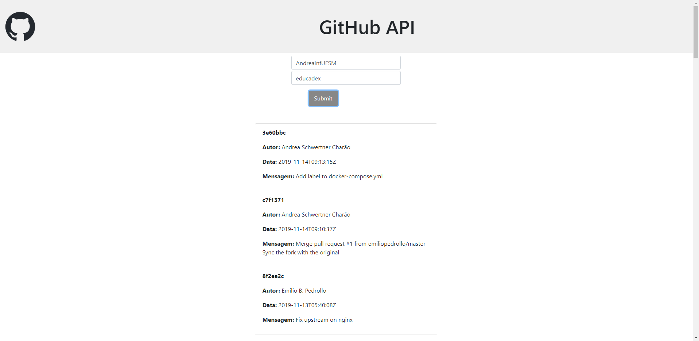

# Projeto2a: GitHub API e DOM Manipulation  
.  

### Daploy

[Link](https://elc1090.github.io/project2a-leonardo-k/)  

### Desenvolvedor

Leonardo Cargnin Krügel  

### Ambiente de desenvolvimento

- VS Code
- Navegador Mozilla Firefox / Google Chrome

### Créditos  
- [GitHub API tutorial](https://codesnippet.io/github-api-tutorial/)  
- [GitHub REST API](https://docs.github.com/en/rest)
- [W3 School: Bootstrap](https://www.w3schools.com/bootstrap/)

### Bastidores  

Eu achei a manipulação do DOM bastante intuitiva, seguindo o tutorial não tive muitos problemas para implementar uma função para fazer requisições à api. A parte que tive mais dificuldades foi em alterar a aparência, primeiro por não ter muitas ideias, segundo na implementação das ideias que tive, mas sinto que lendo um pouco mais sobre bootstrap e css e seguindo com as práticas vou melhorar tanto nas ideias quanto na implementação dessas.  

---
Projeto entregue para a disciplina de [Desenvolvimento de Software para a Web](http://github.com/andreainfufsm/elc1090-2023a) em 2023a
